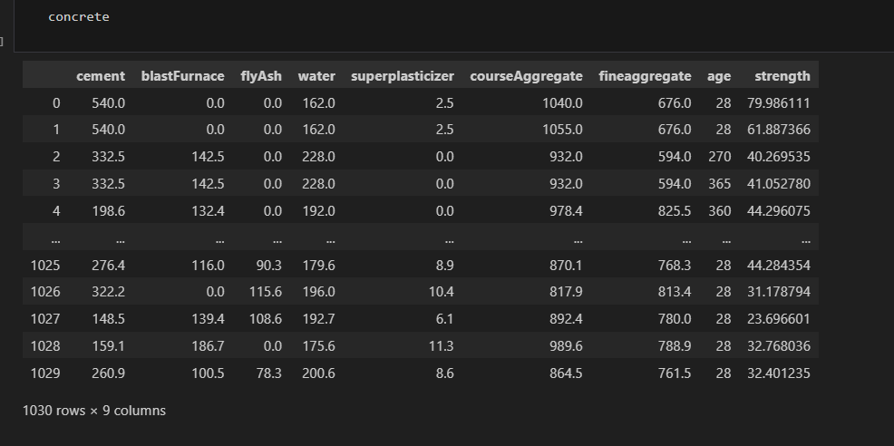
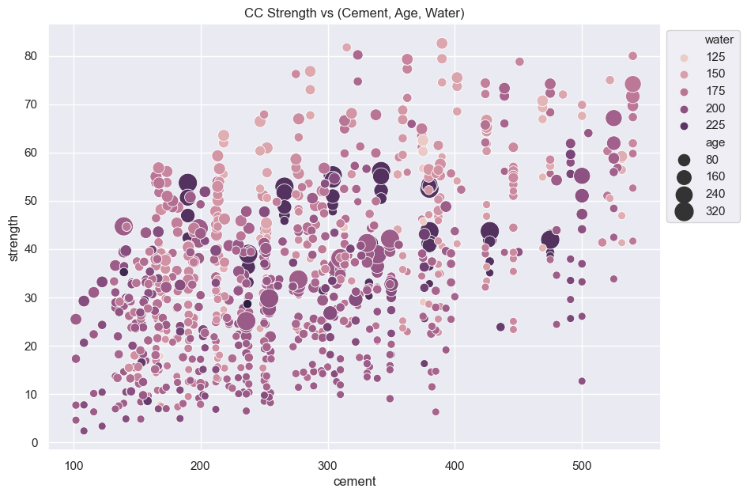
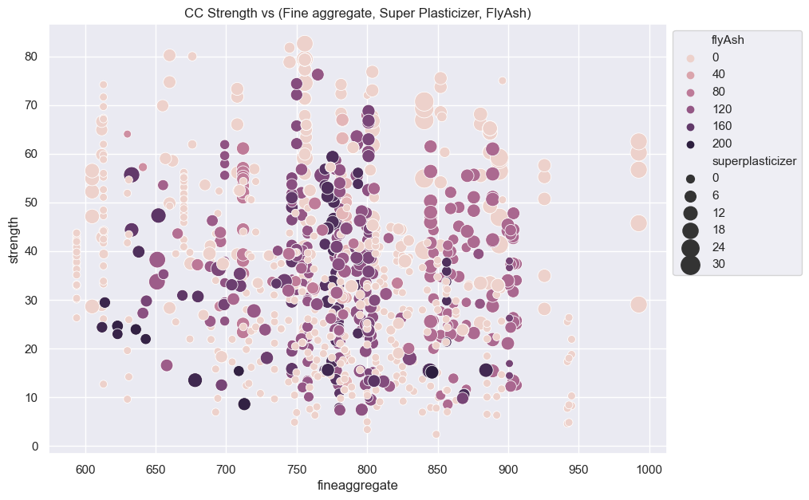
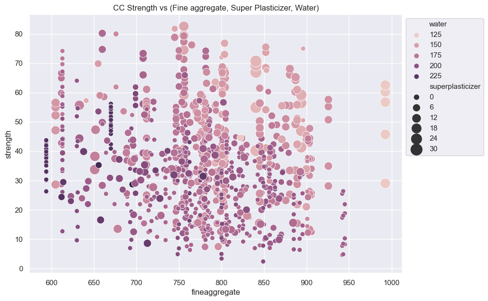
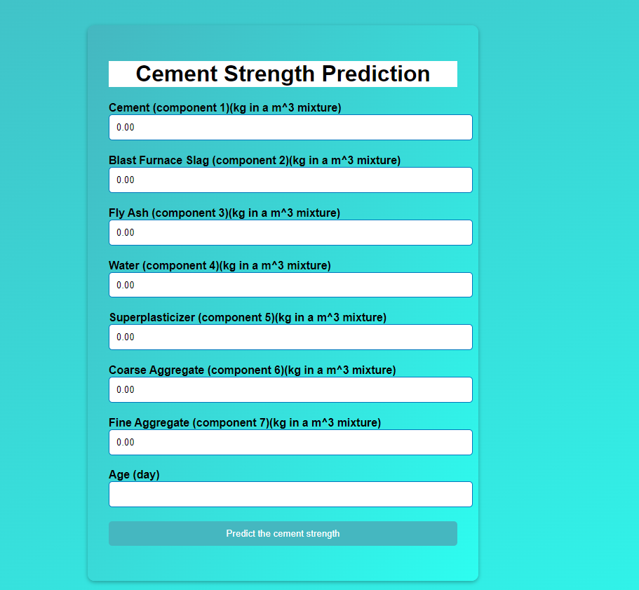

## Concrete strength prediction 

### Dataset & its Goal.
The given dataset contains information on the compressive strength of concrete. The data has nine input variables and one target variable. The input variables are:

- cement: the amount of cement (in kg/m^3) in the concrete mixture
- blastFurnace: the amount of blast furnace slag (in kg/m^3) in the concrete mixture
- flyAsh: the amount of fly ash (in kg/m^3) in the concrete mixture
- water: the amount of water (in kg/m^3) in the concrete mixture
- superplasticizer: the amount of superplasticizer (in kg/m^3) in the concrete mixture
- courseAggregate: the amount of coarse aggregate (in kg/m^3) in the concrete mixture
- fineAggregate: the amount of fine aggregate (in kg/m^3) in the concrete mixture
- age: the age (in days) of the concrete sample when the compressive strength was measured

The target variable is:
- strength: the compressive strength of the concrete (in MPa)

The goal of this dataset is to develop a predictive model that can accurately estimate the compressive strength of concrete based on the given input variables. This model can be useful for engineers and construction companies to optimize the design of concrete mixtures and ensure that the resulting concrete structures meet the required strength specifications.

### Concrete Compressive Strength 
 
Abstract: Concrete is the most important material in civil engineering. The concrete compressive strength is a highly nonlinear function of age and ingredients. These ingredients include cement, blast furnace slag, fly ash, water, superplasticizer, coarse aggregate, and fine aggregate.

- __Summary Statistics:__

- Number of instances (observations): 1030
- Number of Attributes: 9
- Attribute breakdown: 8 quantitative input variables, and 1 quantitative output variable
- Missing Attribute Values: None

<br>

### Setting up Project Environment :

This project is a separate project using Conda of Anaconda. It provides a clear structure for organizing your code and dependencies using a virtual environment. The project includes the following folders and files:

- artifacts/: This folder is used to store any generated artifacts, such as trained models or processed datasets.
- logs/: This folder is used to store log files generated by the application.
- Notebooks/: This folder is used to store Jupyter notebooks for data exploration or experimentation.
- src/: This folder contains the source code of your project.
- templates/: This folder is used to store HTML templates for your Flask application.
- environment/: This folder is used to store the virtual environment created by Conda.
- .gitignore: This file specifies which files and folders should be ignored by Git.
- application.py: This is the main Flask application file.
- setup.py: This file contains the configuration for packaging your project as a Python package.
- path: This Folder contain these files : raw_data, train_data, test_data
- upload_data.py: This file is used to send data to your mongodb Database
- deployment_documentation : This Folder contain the documentation that how to deploy on local or AWS

#### Getting Started

To set up the project, please follow the instructions below:

##### Prerequisites

- Anaconda or Miniconda should be installed on your system.
- Installation
- Clone the project repository:
```
git clone <repository_url>
cd <project_directory>
```

- Create a new Conda environment for the project:
```
conda create --name <env_name> python=3.9
```
- Activate the newly created environment:
```
conda activate <env_name>
```
- Install the project dependencies:

```
pip install -r requirements.txt
```
- Running the Application

Make sure you are in the project directory and the Conda environment is activated.

#### Start the Flask application:

```
'python application.py' 

```
Open a web browser and visit http://localhost:5000 to access the application.

#### Additional Notes

- Having a separate project environment, such as the one created with Conda, offers several advantages:

- Dependency Isolation: By creating a virtual environment, you can install project-specific dependencies without interfering with the system-wide Python installation or other projects on your machine.

- Reproducibility: The project environment ensures that all project contributors are using the same set of dependencies, making it easier to reproduce and share the project's results.

- Version Control: By including the virtual environment in your project repository, you can easily recreate the same environment on different machines or after a fresh clone of the repository.

- Package Management: Using setup.py allows you to define the project's dependencies and make it easier to package and distribute your project as a Python package.

- By following these instructions and organizing your project with a separate environment, you can maintain a clean and reproducible development environment while keeping your project dependencies isolated and well-managed.

<br>

## EDA & Business Implication

EDA stands for exploratory data analysis where we explore our data and grab insights from it. EDA helps us in getting knowledge in form of various plots and diagrams where we can easily understand the data and its features.

- __Data Export from Db:__
The data in a stored database is exported as a CSV file to be used for model training.

- __Data exploration__

The first step in data exploration was to load the data set and examine its structure. The data set was loaded using the pandas library in Python, and its structure was examined using various pandas functions, such as head(), describe(), info(), and shape(). <br>

<br>


- __Data Cleaning__

The data set was cleaned by renaming some of the feature columns to make them more readable, and by checking for and dropping any duplicate rows.

__Data Preprocessing__
The data set was preprocessed by performing several steps, such as handling missing values, scaling the data, and splitting the data into training and testing sets.

- __Handling Missing Values:__ There were no missing values in the data set, so no imputation was necessary.
Scaling the Data: The data was scaled using the StandardScaler function from the sklearn.preprocessing library to ensure that all features were on the same scale and to prevent any single feature from dominating the model.

- __Insights__ 

<br>
#### Observations

- There are'nt any high correlations between Compressive strength and other features except for Cement, which should be the case for more strength.
- Age and Super plasticizer are the other two features which are strongly correlated with Compressive Strength.
- Super Plasticizer seems to have a negative high correlation with Water, positive correlations with Fly ash and Fine aggregate.
<br>

<br>
####  Observations from Strength vs (Cement, Age, Water)
1. Compressive strength increases with amount of cement
2. Compressive strength increases with age
3. Cement with low age requires more cement for higher strength
4. The older the cement is the more water it requires
5. Concrete strength increases when less water is used in preparing it
<br>

<br>
#### Observations from CC Strength vs (Fine aggregate, Super Plasticizer, FlyAsh)

- As Flyash increases the strength decreases
- Strength increases with Super plasticizer
<br>

<br>
#### Observations from CC Strength vs (Fine aggregate, Super Plasticizer, Water)

- Strength decreases with increase in water, strength increases with increase in Super plasticizer (already from above plots)
- More Fine aggregate is used when less water, more Super plasticizer is used.
- Although we are making conclusions by observing the scatter plots, there is an underlying non linear interaction between features which we cannot visualize
<br>

## Model Training with Feature Selection, Feature Engineering, and Outlier Detection

In this project, we aim to predict the price of a given dataset using machine learning models. Before training the models, we perform the following steps:

- Data Splitting: We split the dataset into training and testing sets. The training set is used to train the models, while the testing set is used to evaluate their performance.

- Feature Selection: We apply feature selection techniques to identify the most relevant features for our prediction task. This helps in reducing the dimensionality of the dataset and improving the model's performance.

- Feature Engineering: We perform feature engineering to transform the existing features or create new features that can provide more meaningful information to the models. This step aims to enhance the predictive power of the features.

- Outlier Detection: We detect and handle outliers in the dataset. Outliers can significantly affect the performance of the models, so it is crucial to identify and handle them appropriately.

__Once these preprocessing steps are completed, we proceed to train the machine learning models.__ The following models are included in our project:

- LinearRegression: Linear regression is a popular and simple regression model that fits a linear relationship between the features and the target variable.

- Lasso: Lasso regression is a linear regression model that incorporates L1 regularization. It can help in feature selection by shrinking the coefficients of less relevant features to zero.

- Ridge: Ridge regression is another linear regression model that uses L2 regularization. It helps in reducing multicollinearity and can improve the model's performance.

- Random Forest Regression is known for its ability to handle complex relationships in the data, handle missing values, and reduce overfitting, making it a popular choice for various regression tasks.

- XGBoost is popular for its high performance, scalability, and ability to handle large datasets efficiently. It has won several machine learning competitions and is widely used in various applications, including regression, classification, ranking, and recommendation systems.

__After evaluating the performance of these models, we have selected the Random Forest Regression as our final model due to its ability to handle complex relationships in the data.__
<br>

To provide a user-friendly interface, we have integrated the model into a Flask application. The Flask application serves as the front-end of the project, allowing users to interact with the trained model and make predictions based on their inputs.

The Flask application can be accessed by running the application.py file. It provides a web interface where users can input the required features, and the model will predict the price based on the provided information.
<br>

<br>
<br>

Using Flask for the front-end enables a seamless integration of the machine learning model into a user-friendly web application, enhancing the usability and accessibility of the project.

By following the steps outlined above and utilizing Flask for the front-end, you can effectively train a model to predict prices, incorporating feature selection, feature engineering, outlier detection, and a user-friendly interface.

### AUTHOR
<hr>
<strong>Shehryar Gondal</strong>


You can get in touch with me on my LinkedIn Profile:<br>
 <a href = "https://linkedin.com/in/shehryar-gondal-data-analyst"></a>

You can also follow my GitHub Profile to stay updated about my latest projects:<br>
<a href = "https://github.com/ShehryarGondal1"></a>


If you liked the repo then kindly support it by giving it a star ⭐.
